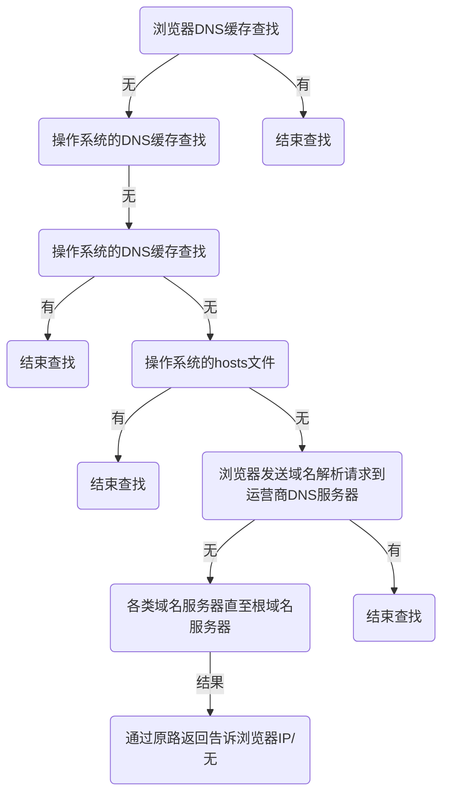

## 域名解析，获取IP地址




## 三次握手，建立TCP连接

**三次握手，建立TCP连接**

``` mermaid
sequenceDiagram
	participant Client
	participant Server
	
        Client->> + Server: Seq=0
				Server->>  Client: ACK=Seq+1
				Client->> - Server: Seq=ACK+1
```


## 发送HTTP请求

>  建立连接之后，开始发送HTTP请求，与服务器传输数据，如果数据过大会分片传输

**在不同版本的HTTP，传输的过程有不一样**

- HTTP 1.0

  一个连接只能完成一个HTTP请求，比如只能完成一次index.html的响应，而index.html中的 js/css/img则需要另外再建立连接，再重复三次握手的过程

- HTTP 1.1

  一个连接可完成多个HTTP请求，这样index.html中的js/css/img 则不需要再有三次握手的开销，一次TCP连接全搞定

- HTTP 2.0

  一个连接可并发HTTP请求

- HTTP 3.0


## 四次挥手，关闭请求

可以是客户端发送关闭请求，也可以是服务端关闭

``` mermaid
sequenceDiagram
	participant Client
	participant Server
	
        Client->> + Server: FIN=0
				Server->>  Client: ACK=Seq+1
				Client->> - Server: Seq=ACK+1
				Client->> - Server: Seq=ACK+1
				
```


