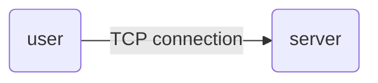

### TCP connection

在客户端向服务器发送HTTP请求的时候，会建立一个`TCP connection`，HTTP基于`TCP connection` 通道来进行数据的请求和响应。

***建立连接的时候，有三次握手的消耗***




#### 不同HTTP版本的TCP connection 

- HTTP 1.0

  在一个HTTP请求时候则建立，在响应之后连接关闭

- HTTP 1.1

  在第一个HTTP请求时候则建立，并且不会关闭，第二个请求发送的时候不会重新建立连接，那第二次请求则没有三次握手的开销。

- HTTP 2.0

  同一个用户对同一个服务器发送网络请求的时候，只需要一个TCP connection 连接，可以并发的进行HTTP请求响应


## 三次握手

- 发生在传输层

- 是TCP连接建立的一个过程

  

#### 为什么建立连接的时候要三次握手

防止服务端开启一些无用的连接

```mermaid
sequenceDiagram
	participant Client
	participant Server
	
	rect rgba(0, 0, 255, .1)
				Note over Client,Server: 三次握手，建立TCP连接
        Client->> + Server: seq=0
				Server->>  Client: ACK=0
				Client->> - Server: seq=0
   end
   
   
  rect rgba(0, 0, 255, .1) 
   			Note over Client,Server:发送HTTP请求， 传输数据
        Client->> + Server: seq=0
				Server->>  Client: seq=0
				Client->> - Server: seq=0
   end
   
   rect rgba(0, 0, 255, .1)  
   			Note over Client,Server:四次挥手， 断开连接
        Client->> + Server: FIN=0
				Server->>  Client: seq=0
				Client->> - Server: seq=0
   end
	
```

